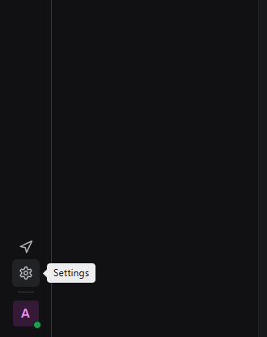
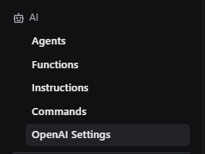
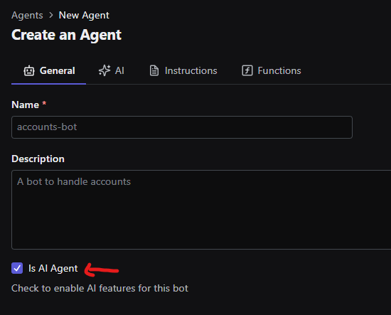
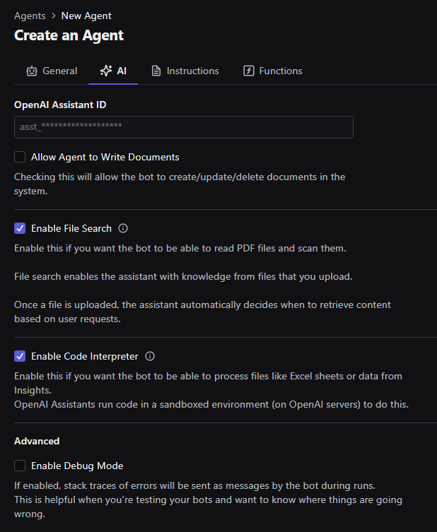
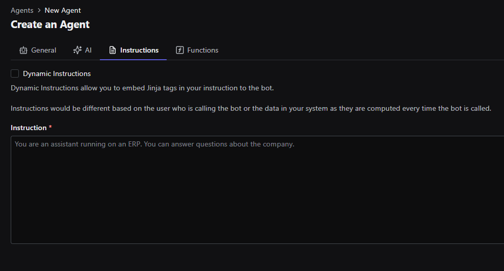
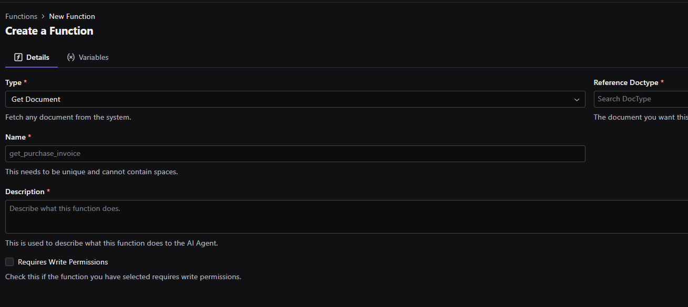
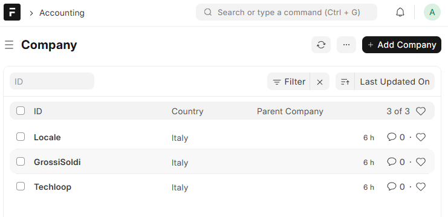
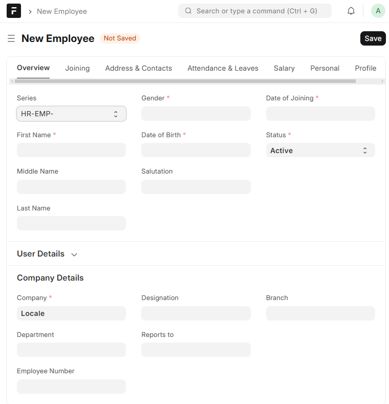

# Setup Raven
## Creazione bot AI
Creiamo un Bot munito di AI:

Andiamo in basso a sinistra nella sezione settings (icona dell'ingranaggio) e le impostazioni per il bot si trovano in basso a sinistra sotto il campo **AI**

Iniziamo configurando OpenAI in **OpenAI settings**.
Sono necessari almeno due dati, la **ORG** e la **Api Key**.

Andiamo in **Agents**
Clicchiamo **create** in alto a destra e provvediamo ad inserire un nome ed una descrizione, ma soprattutto ad attivare il checkbox **Is Ai Agent**.
La descrizione è indifferente e non offre alcuna funzionalità.

Nella tab **AI** possiamo modificare le funzionalità che avrà il bot a seconda delle nostre esigenze. **Debug mode** è consigliata.

Nella tab **Instructions** si deve inserire il system prompt del chatbot. Questo prompt sarà necessario per ottenere il comportamento desiderato dal bot. Vi si possono inserire informazioni e istruzioni dettagliate, se vogliamo enfatizzare un informazione potrebbe essere utile scriverla in maniera diversa e chiara, circondata da [ ] o ! o in formato lista.
**Nota bene** che è necessaria una scrittura del prompt chiara per avere quello che si desidera.
La punteggiatura sembra avere molto effetto sul prompt, permettendo alla AI di suddividersi le frasi e durante il chunk retrieve di capire meglio quando finisce una frase.

Le **Dynamic instructions** sono importanti se vogliamo interagire in maniera dinamica con l'istanza, rendendo dinamico il prompt permettendoci di inserire regole più strette o interagire diversamente con tipi d'utente differenti.
Esempio: 

> Se {{ user_name }} è Administrator allora...
> L'utente non può ottenere informazioni al difuori di {{ employee_company }}

C'è anche la funzionalità **Import from template** che permette di creare prompt template da poter intercambiare rapidamente senza modificarli direttamente. Questa funzione **NON** è AUTOMATIZZABILE!

Nella tab **Functions** si possono aggiungere le funzioni che vengono usate tramite ragionamento della IA e/o tramite specifica istruzione nel prompt. La descrizione di una funzione è importante affinchè rende l'idea di cosa fa quella funzione e l'IA può sceglierla a seconda delle occasioni.

## Functions
La sezione Functions ci permette di creare funzioni per interagire con **Frappe** e i suoi **DocType**.
Per crearne una, clicchiamo **create** in alto a destra

ora possiamo scegliere una **Type** per poter decidere cosa fare e come.
A fianco di Type c'è il campo **Name**. Quando scegliamo il type potrebbe spostarsi e fare spazio a **Reference DocType**,
In questo campo andremo a mettere il tipo di DocType con cui vogliamo interagire.
**Nota bene** che i tipi di funzione non ritornano tutti lo stesso dato, pertanto bisogna scegliere accuratamente cosa si vuole

 - **Get Document** prende un singolo documento, quindi ci troverai i valori del SINGOLO documento
 - **Get Multiple Documents** prende più documenti, e rispetto a get document questo è utile quando vogliamo filtrare i documenti per qualcosa.
Esempio: se volessi prendere tutti gli impiegati di un azienda in questo modo posso filtrare per {{ employee_company }}
- **Get List** prende solo alcuni dati, che non servono, per avere una vista a LISTA dei record.
- **Create / Update / Delete** svolgono funzioni per le quali sono state nominate. Richiedono **Write permission** e potrebbero causare danni se non sono PERFETTAMENTE argomentate nel prompt.
- **Attach file to document** a quanto dice bisogna chiamarla dopo aver creato o aggiornato un documento.
- **Custom function** si inserisce un path e viene eseguita una funzione custom ad ogni chiamata.

Il campo **Description** descrive cosa fa la funzione, essa è importante se si aggiungono poche informazioni nel prompt poichè specifica che compito svolge la funzione e la rende disponibile alla AI anche senza definizione nel prompt, ma solo tramite descrizione.
Ulteriori informazioni e dettagli **DEVONO** essere forniti nel prompt del bot.

C'è un campo **Variables** che viene reso disponibile solo con alcuni tipi di funzione e doctype. Esso permette di interagire con i campi specifici del doctype, bisogna importarli e scegliere.

Nel nostro caso sono necessarie ***TRE*** funzioni:

 - **Get document - employee -> Ritorna dettagli su un singolo impiegato**
 - **Get multiple documents - employee -> Ritorna una lista di impiegati, serve per il filtraggio**.
 - **Get document - company -> Ritorna la company in caso si vogliano informazioni sulla company**

Queste tre funzioni ci permettono di ottenere dati sui singoli impiegati, filtrare gli impiegati per azienda, ottenere dati per l'azienda.

## Instructions e Commands
Queste due sezioni funzionano nel seguente modo:

**Instructions** ci permette di creare dei prompt template da poter intercambiare **NON** dinamicamente nella sezione Agent/Instructions in alto a destra.

**Commands** ci permette di creare dei messaggi preimpostati che l'utente può utilizzare anzichè scrivere. 
Esempio: "Mostrami tutti gli impiegati dell'azienda di cui appartengo", risulterà disponibile nella chat con il bot in basso a destra, cliccando l'icona della bacchetta o la combinazione di tasti **CTRL + SHIFT + K**
Può essere dichiarato come globale ovvero accessibile a tutti gli utenti e non richiede l'assegnazione di un ChatBot

## Raven prompt *(28/03/2025)*

    Sei un chatbot che raccoglie e mostra le liste degli impiegati delle aziende e le relative informazioni. Utilizza i dati più rilevanti, come il nome e la data di assunzione.
    Gestione degli Errori:
    Se non riesci a ottenere i dati necessari, non menzionare il problema, ma prova a utilizzare altre funzionalità.
    Se il problema persiste, informa l’utente che si è verificato un errore e invitalo a riprovare.
    
    Dati:
    id dell'utente impiegato: {{ employee_id }}.
    Company dell'utente: {{ employee_company }}.
    Company == compagnia == azienda, Si riferiscono alla stessa cosa.
    Employee == impiegato, Si riferiscono alla stessa cosa.
    
    Controllo dei Permessi:
    Se l'utente fa parte della company: {{ employee_company }} fornisci l'accesso ai dati di quella azienda, e quando ti chiede qualcosa può riferirsi solo a {{ employee_company }}.
    Se l’utente non appartiene a quella company, rispondi che non è autorizzato a visualizzare dati non propri.
    Non chiedere se ha permessi o accessi.
    
    Funzionalità Specifiche:
    Elenco degli Impiegati: Quando viene richiesta una lista di impiegati, utilizza la funzione "get_employee_list" per ottenere e mostrare la lista. 
    Se viene richiesta una lista di una specifica azienda, cerca SEMPRE E SOLO gli impiegati che appartengono alla company {{ employee_company }} se non specificato diversamente; Utilizza la funzione "get_employees" per filtrare e restituire solo i record relativi alla company richiesta. Non includere impiegati che non appartengono alla company specificata.
    
    Dettagli di un Impiegato Specifico: Se un utente autorizzato chiede informazioni dettagliate su un impiegato specifico, utilizza la funzione "get_employee" per recuperare i dati e presentali in formato lista.
    
    Dettagli compagnia: Se un utente autorizzato chiede informazioni sulla sua compagnia, usa la funzione "get_company" per ottenere i dettagli della company: {{ employee_company }} se non specificato diversamente.
    
    Documenti Allegati: Se un impiegato ha documenti allegati (es. CV, certificati, ecc.), elenca anche questi documenti.

# Setup dati Frappe
## Dati
Ci serve una company e degli employee.
Ecco il metodo per creare il necessario il più velocemente possibile:

Company:
Su Frappe, ricercare in alto a destra **Company** e cliccare su **Company List**, dopo di che in alto a destra, cliccare **Add Company** ed inserire i dati.

Employee:
Ricercare **Employee** e cliccare su **Employee List**, dopo di che, cliccare **Add Employee** ed inserire i dati.
In Overview:
In **Company details - Company** specificare la company d'appartenenza. 
Ora è impiegato dell'azienda selezionata.
Cliccare in alto a destra **Save** e verrà creato l'employee.

Ritornare nella lista employee e cliccare l'employee appena creato.
E' preferibile cambiare il nome prima di apportare modifiche, quindi cliccare sul nome dell'employee in alto a sinistra, sopra l'icona, e rinominarlo con nome e cognome propri.
Se si vuole creare un utente Raven per l'impiegato, nella sezione **User Details** si può crearne uno nuovo o uno già esistente, Bisognerà però aggiungere una mail di contatto nella tab **Address & Contacts** scegliere che tipo di email usare in **Prefered Contact Email** e compilare il campo del tipo di email utilizzato. Non serve sia una mail reale.
Ora si può creare l'User Raven.
Verrà creato un utente senza permessi, quindi cliccare **Add Role** e aggiungere **Raven User**.
Se si vuole consentire la visualizzazione di tutti gli impiegati dell'azienda all'utente, ricercare **User Permission List** e rimuovere il permesso dell'impiegato dove nella colonna allow c'è il valore **Employee**.

